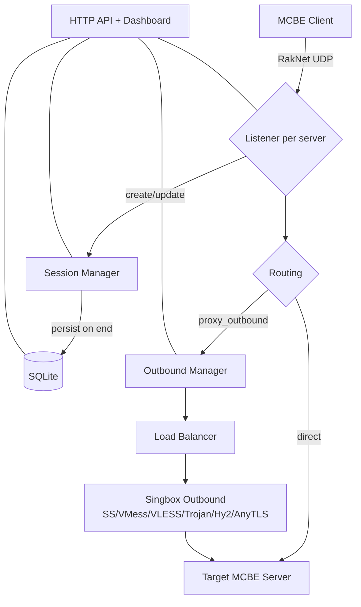
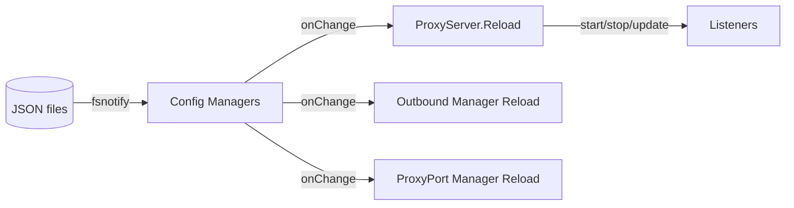

# MCPE Server Proxy (mcpeserverproxy)

一个面向 Minecraft Bedrock Edition (MCBE) 的高性能 UDP 代理/中转服务器，专为游戏加速和流量转发设计。

## 核心特性

### 🚀 高性能代理
- **多协议支持**: Shadowsocks / VMess / VLESS / Trojan / Hysteria2 / AnyTLS
- **智能负载均衡**: 支持按组/节点列表做负载均衡与自动故障切换
- **多种代理模式**: transparent / raknet / passthrough / raw_udp / mitm
- **实时延迟检测**: 自动选择最优节点，确保最佳游戏体验

### 📊 数据统计与监控
- **会话统计**: 实时追踪玩家连接、流量使用、在线时长
- **玩家记录落库**: SQLite 持久化存储，支持历史查询
- **ACL 访问控制**: 黑/白名单管理，支持 IP、UUID、玩家名过滤
- **Prometheus 集成**: 标准化监控指标，便于对接 Grafana 等监控系统

### 🎛️ 管理与控制
- **REST API**: 完整的 HTTP API，支持服务管理、配置热更新
- **Web Dashboard**: 内嵌 Vue 3 控制台，可视化操作界面
- **配置热更新**: 文件变更自动生效，无需重启服务
- **多租户支持**: API Key 认证，支持多用户管理

### 🔒 安全与认证
- **Xbox Live 认证**: 支持代登录功能
- **外部认证集成**: 可对接第三方认证系统
- **API 密钥管理**: 灵活的权限控制机制
- **访问日志**: 完整的访问审计记录

## 项目结构

本仓库包含完整的 Go 后端（`cmd/` + `internal/`）以及前端控制台（`web/`）。

```
.
├── cmd/mcpeserverproxy/    # 主程序入口
├── internal/                # 核心业务逻辑
│   ├── acl/                # 访问控制列表管理
│   ├── api/                # REST API 服务
│   ├── auth/               # 认证模块（Xbox Live、外部认证）
│   ├── config/             # 配置管理与热更新
│   ├── db/                 # 数据库层（SQLite）
│   ├── logger/             # 日志系统
│   ├── monitor/            # 系统监控（Prometheus）
│   ├── proxy/              # 代理核心实现
│   └── session/            # 会话管理
├── web/                    # Vue 3 前端控制台
├── doc/                    # 文档和示例配置
└── build.bat              # Windows 构建脚本
```

## 目录

- [快速开始](#快速开始)
- [整体架构](#整体架构)
- [核心流程图](#核心流程图)
- [配置文件](#配置文件)
- [代理模式（proxy_mode）](#代理模式-proxy_mode)
- [上游节点与负载均衡（proxy_outbounds）](#上游节点与负载均衡-proxy_outbounds)
- [本地代理端口（proxy_ports）](#本地代理端口-proxy_ports)
- [API 与 Dashboard](#api-与-dashboard)
- [监控与日志](#监控与日志)
- [开发与构建](#开发与构建)
- [安全注意事项](#安全注意事项)

## 快速开始

### 1. 准备配置文件

首次运行时，程序会自动创建缺失的配置文件（不会覆盖已存在的文件）：

- [`config.json`](#配置文件-configjson)（会写入默认配置）
- [`server_list.json`](#服务器配置-server_listjson)（初始化为 `[]`）
- [`proxy_outbounds.json`](#上游节点配置-proxy_outboundsjson)（初始化为 `[]`）
- [`proxy_ports.json`](#代理端口配置-proxy_portsjson)（初始化为 `[]`）

### 2. 运行程序

#### Windows

```bash
# 使用默认配置运行
mcpeserverproxy.exe

# 使用自定义配置路径运行
mcpeserverproxy.exe -config config.json -servers server_list.json

# 启用调试模式
mcpeserverproxy.exe -debug

# 查看版本信息
mcpeserverproxy.exe -version
```

#### Linux / macOS

```bash
# 使用默认配置运行
./mcpeserverproxy

# 使用自定义配置路径运行
./mcpeserverproxy -config config.json -servers server_list.json

# 启用调试模式
./mcpeserverproxy -debug

# 查看版本信息
./mcpeserverproxy -version
```

### 3. 访问 Web 控制台

- **API 默认监听**: `:8080`（可在 [`config.json`](#配置文件-configjson) 的 `api_port` 修改）
- **Dashboard 默认入口**: `/mcpe-admin/`（可在 [`config.json`](#配置文件-configjson) 的 `api_entry_path` 修改）

访问示例：`http://127.0.0.1:8080/mcpe-admin/`

### 4. 基本使用流程

1. **配置上游节点**: 在 Dashboard 或直接编辑 [`proxy_outbounds.json`](#上游节点配置-proxy_outboundsjson) 添加你的代理节点
2. **添加服务器**: 在 [`server_list.json`](#服务器配置-server_listjson) 中添加要代理的 MCBE 服务器
3. **选择代理模式**: 根据需求选择合适的 [`proxy_mode`](#代理模式-proxy_mode)
4. **配置负载均衡**: 为多个服务器设置负载均衡策略
5. **启动服务**: 通过 Dashboard 或 API 启动/停止各个服务器代理
6. **监控状态**: 在 Dashboard 实时查看在线玩家、流量统计、节点延迟等信息

## 整体架构

入口：`cmd/mcpeserverproxy/main.go`

主要组件：
- `internal/config`: 配置加载 + 热更新（fsnotify 监听 JSON 文件变化）
- `internal/proxy`: 代理核心（多种 proxy_mode、会话、转发、上游节点、负载均衡、代理端口）
- `internal/api`: Gin API + 内嵌 Dashboard（`internal/api/dist/` embed）
- `internal/session`: 玩家会话与 GC
- `internal/db`: SQLite 持久化（会话历史、玩家、ACL、API Keys）
- `internal/acl`: 黑/白名单与访问控制策略
- `internal/monitor`: 系统监控 + Prometheus
- `internal/logger`: 分级日志 + 文件轮转

## 核心流程图

### 1) 数据流（客户端 -> 目标服务器）



### 2) 配置热更新（文件变更 -> 自动生效）



### 3) 组负载均衡 + 故障切换（@group / node1,node2）

```mermaid
flowchart TD
  Req[Need upstream] --> Sel{proxy_outbound}
  Sel -->|direct/empty| Direct[Dial direct]
  Sel -->|single node| N1[Dial node]
  Sel -->|@group| G[Select from group]
  Sel -->|node list| NL[Select from list]

  G --> LB[Strategy: least-latency/rr/random/least-conns]
  NL --> LB
  LB --> Try[Dial selected]
  Try -->|ok| OK[Use connection]
  Try -->|fail| Ex[Exclude node and retry]
  Ex --> LB
```

## 配置文件

程序运行时会用到 4 个 JSON 配置文件，所有配置都支持热更新，修改后自动生效。

### 配置文件概览

| 配置文件 | 用途 | 是否必需 |
|---------|------|---------|
| [`config.json`](#配置文件-configjson) | 全局配置（API 端口、数据库、日志、鉴权等） | ✅ 必需 |
| [`server_list.json`](#服务器配置-server_listjson) | 要监听的 MCBE 服务列表 | ✅ 必需 |
| [`proxy_outbounds.json`](#上游节点配置-proxy_outboundsjson) | 上游节点（用于代理转发） | ⚪ 可选 |
| [`proxy_ports.json`](#代理端口配置-proxy_portsjson) | 本地 HTTP/SOCKS 代理端口 | ⚪ 可选 |

> **注意**: 本仓库默认不跟踪这些运行时配置（已加入 [`.gitignore`](.gitignore)）。首次运行会自动创建缺失的配置文件，然后你再按需修改即可。

---

### 配置文件 (config.json)

全局配置文件，控制程序的整体行为。

#### 完整配置示例

```json
{
  "max_session_records": 100,
  "max_access_log_records": 100,
  "api_port": 8080,
  "api_key": "",
  "api_entry_path": "/mcpe-admin",
  "database_path": "data.db",
  "debug_mode": false,
  "log_dir": "logs",
  "log_retention_days": 7,
  "log_max_size_mb": 100,
  "auth_verify_enabled": false,
  "auth_verify_url": "http://127.0.0.1:818/jiasuip/index.php",
  "auth_cache_minutes": 15,
  "proxy_ports_enabled": true,
  "passthrough_idle_timeout": 30,
  "public_ping_timeout_seconds": 5
}
```

#### 配置字段说明

| 字段 | 类型 | 默认值 | 说明 |
|------|------|--------|------|
| `max_session_records` | int | 100 | 数据库中保留的最大会话记录数 |
| `max_access_log_records` | int | 100 | 数据库中保留的最大访问日志记录数 |
| `api_port` | int | 8080 | API 服务监听端口 |
| `api_key` | string | "" | API 访问密钥（留空则仅允许本机访问） |
| `api_entry_path` | string | "/mcpe-admin" | Web Dashboard 访问路径 |
| `database_path` | string | "data.db" | SQLite 数据库文件路径 |
| `debug_mode` | bool | false | 是否启用调试模式（详细日志） |
| `log_dir` | string | "logs" | 日志文件存储目录 |
| `log_retention_days` | int | 7 | 日志文件保留天数 |
| `log_max_size_mb` | int | 100 | 单个日志文件最大大小（MB） |
| `auth_verify_enabled` | bool | false | 是否启用外部认证验证 |
| `auth_verify_url` | string | "" | 外部认证验证 URL |
| `auth_cache_minutes` | int | 15 | 认证结果缓存时长（分钟） |
| `proxy_ports_enabled` | bool | true | 是否启用本地代理端口功能 |
| `passthrough_idle_timeout` | int | 30 | passthrough 模式空闲超时（秒） |
| `public_ping_timeout_seconds` | int | 5 | 公开状态接口的 ping 超时（秒） |

---

### 服务器配置 (server_list.json)

定义要代理的 MCBE 服务器列表。

#### 完整配置示例

```json
[
  {
    "id": "cubecraft",
    "name": "CubeCraft Games",
    "target": "mco.cubecraft.net",
    "port": 19132,
    "listen_addr": "0.0.0.0:19132",
    "protocol": "raknet",
    "enabled": true,
    "disabled": false,
    "send_real_ip": false,
    "resolve_interval": 300,
    "idle_timeout": 300,
    "buffer_size": -1,
    "disabled_message": "§c服务器维护中§r\n§7请稍后再试",
    "custom_motd": "MCPE;§aCubeCraft Proxy;712;1.21.50;0;100;12345678901234567;CubeCraft;Survival;1;19132;19132;0;",
    "proxy_mode": "passthrough",
    "xbox_auth_enabled": false,
    "xbox_token_path": "xbox_token.json",
    "proxy_outbound": "全三网入口IPLC专线节点",
    "show_real_latency": true,
    "load_balance": "least-latency",
    "load_balance_sort": "udp",
    "auto_ping_interval_minutes": 5
  }
]
```

#### 配置字段说明

| 字段 | 类型 | 必需 | 说明 |
|------|------|------|------|
| `id` | string | ✅ | 服务器唯一标识符 |
| `name` | string | ✅ | 服务器显示名称 |
| `target` | string | ✅ | 目标服务器地址（域名或 IP） |
| `port` | int | ✅ | 目标服务器端口（通常为 19132） |
| `listen_addr` | string | ✅ | 监听地址（如 `0.0.0.0:19132`） |
| `protocol` | string | ✅ | 协议类型（通常为 `raknet`） |
| `enabled` | bool | ✅ | 是否启用此服务器 |
| `disabled` | bool | ✅ | 是否拒绝新连接（当 enabled=true 时） |
| `send_real_ip` | bool | ⚪ | 是否发送真实 IP 到目标服务器 |
| `resolve_interval` | int | ⚪ | DNS 解析间隔（秒） |
| `idle_timeout` | int | ⚪ | 空闲超时（秒） |
| `buffer_size` | int | ⚪ | UDP 缓冲区大小（-1 为自动） |
| `disabled_message` | string | ⚪ | 服务器禁用时的自定义消息 |
| `custom_motd` | string | ⚪ | 自定义 MOTD（服务器描述） |
| `proxy_mode` | string | ⚪ | 代理模式（见[代理模式说明](#代理模式-proxy_mode)） |
| `xbox_auth_enabled` | bool | ⚪ | 是否启用 Xbox Live 认证 |
| `xbox_token_path` | string | ⚪ | Xbox Token 文件路径 |
| `proxy_outbound` | string | ⚪ | 上游节点名称、组名或节点列表 |
| `show_real_latency` | bool | ⚪ | 是否显示真实延迟 |
| `load_balance` | string | ⚪ | 负载均衡策略 |
| `load_balance_sort` | string | ⚪ | 延迟排序类型（udp/tcp/http） |
| `auto_ping_interval_minutes` | int | ⚪ | 自动 ping 间隔（分钟） |

---

### 上游节点配置 (proxy_outbounds.json)

定义用于代理转发的上游节点。

#### 完整配置示例

```json
[
  {
    "name": "🇭🇰 香港 06",
    "type": "trojan",
    "server": "f7c5a058-fa4a-4f7c-aed6-203efaf52286.example.com",
    "port": 10106,
    "enabled": true,
    "group": "香港节点",
    "password": "your-password-here",
    "tls": true,
    "sni": "sni.example.com",
    "insecure": true,
    "udp_available": true,
    "udp_latency_ms": 260
  },
  {
    "name": "Hysteria2-misaka",
    "type": "hysteria2",
    "server": "103.189.141.183",
    "port": 52120,
    "enabled": true,
    "password": "d9374778",
    "tls": true,
    "sni": "www.bing.com",
    "insecure": true,
    "tcp_latency_ms": 106,
    "http_latency_ms": 1251,
    "udp_available": true,
    "udp_latency_ms": 1230
  }
]
```

#### 支持的节点类型

| 类型 | 说明 | 必需字段 |
|------|------|---------|
| `shadowsocks` | Shadowsocks 协议 | server, port, password, method |
| `vmess` | VMess 协议 | server, port, uuid, security |
| `vless` | VLESS 协议 | server, port, uuid |
| `trojan` | Trojan 协议 | server, port, password |
| `hysteria2` | Hysteria2 协议 | server, port, password |
| `anytls` | AnyTLS 协议 | server, port, password |

#### 配置字段说明

| 字段 | 类型 | 必需 | 说明 |
|------|------|------|------|
| `name` | string | ✅ | 节点名称（唯一标识） |
| `type` | string | ✅ | 节点类型 |
| `server` | string | ✅ | 节点服务器地址 |
| `port` | int | ✅ | 节点端口 |
| `enabled` | bool | ✅ | 是否启用此节点 |
| `group` | string | ⚪ | 节点分组名称 |
| `password` | string | ⚪ | 密码（部分协议需要） |
| `uuid` | string | ⚪ | UUID（VMess/VLESS 需要） |
| `method` | string | ⚪ | 加密方法（Shadowsocks 需要） |
| `security` | string | ⚪ | 安全级别（VMess 需要） |
| `tls` | bool | ⚪ | 是否启用 TLS |
| `sni` | string | ⚪ | TLS SNI |
| `insecure` | bool | ⚪ | 是否跳过证书验证 |
| `udp_available` | bool | ⚪ | 是否支持 UDP |
| `udp_latency_ms` | int | ⚪ | UDP 延迟（毫秒） |
| `tcp_latency_ms` | int | ⚪ | TCP 延迟（毫秒） |
| `http_latency_ms` | int | ⚪ | HTTP 延迟（毫秒） |

---

### 代理端口配置 (proxy_ports.json)

配置本地 HTTP/SOCKS 代理端口，用于将其他应用的流量通过上游节点转发。

#### 完整配置示例

```json
[
  {
    "id": "proxy-1769433128665",
    "name": "新代理端口",
    "listen_addr": "0.0.0.0:1080",
    "type": "mixed",
    "enabled": true,
    "proxy_outbound": "HK-1,剩余流量：199.82 GB,HK-2",
    "load_balance": "least-latency",
    "load_balance_sort": "tcp",
    "allow_list": [
      "0.0.0.0/0"
    ]
  }
]
```

#### 配置字段说明

| 字段 | 类型 | 必需 | 说明 |
|------|------|------|------|
| `id` | string | ✅ | 代理端口唯一标识符 |
| `name` | string | ✅ | 代理端口显示名称 |
| `listen_addr` | string | ✅ | 监听地址（如 `0.0.0.0:1080`） |
| `type` | string | ✅ | 代理类型（http/socks5/socks4/mixed） |
| `enabled` | bool | ✅ | 是否启用此代理端口 |
| `proxy_outbound` | string | ⚪ | 上游节点名称、组名或节点列表 |
| `load_balance` | string | ⚪ | 负载均衡策略 |
| `load_balance_sort` | string | ⚪ | 延迟排序类型（udp/tcp/http） |
| `allow_list` | array | ⚪ | 允许的 IP 段（CIDR 格式） |
| `username` | string | ⚪ | 代理用户名（可选） |
| `password` | string | ⚪ | 代理密码（可选） |

## 代理模式 (proxy_mode)

[`server_list.json`](#服务器配置-server_listjson) 的每个服务可通过 `proxy_mode` 选择不同的代理实现方式，每种模式都有其特定的使用场景和功能特性。

### 模式对比

| 模式 | 性能 | 功能完整性 | 上游节点支持 | 适用场景 |
|------|------|-----------|------------|---------|
| `transparent` | ⭐⭐⭐⭐⭐ | ⭐⭐ | ❌ | 纯转发，无需协议解析 |
| `raknet` | ⭐⭐⭐⭐ | ⭐⭐⭐⭐ | ✅ | 需要协议控制 + 上游节点 |
| `passthrough` | ⭐⭐⭐⭐ | ⭐⭐⭐⭐⭐ | ✅ | 提取信息 + 保持原始流量 |
| `raw_udp` | ⭐⭐⭐⭐ | ⭐⭐⭐ | ✅ | 兼容性优先 + 上游转发 |
| `mitm` | ⭐⭐⭐ | ⭐⭐⭐⭐⭐ | ✅ | 完整协议可见性 + Xbox 代登录 |

### 详细说明

#### 1. transparent（透明 UDP 转发）

**特点**：
- 性能最优，协议处理最少
- 纯粹的 UDP 数据包转发
- 不解析 RakNet 或游戏协议

**适用场景**：
- 只需要简单的流量转发
- 不需要访问玩家信息或协议数据
- 对性能要求极高的场景

**限制**：
- ❌ 不支持上游节点（`proxy_outbound`）
- ❌ 无法提取玩家信息
- ❌ 无法进行协议级别的控制

**配置示例**：
```json
{
  "id": "simple-proxy",
  "name": "简单转发",
  "proxy_mode": "transparent",
  "target": "mc.example.com",
  "port": 19132,
  "listen_addr": "0.0.0.0:19132"
}
```

---

#### 2. raknet（RakNet 层代理）

**特点**：
- 使用 `go-raknet` 库进行 RakNet 协议处理
- 支持完整的 RakNet 会话管理
- 可结合上游节点使用
- 支持更丰富的连接控制

**适用场景**：
- 需要使用上游节点进行加速
- 需要基于 RakNet 协议的连接管理
- 需要更好的连接稳定性

**支持的功能**：
- ✅ 支持上游节点（`proxy_outbound`）
- ✅ 提取玩家基本信息
- ✅ 连接状态管理
- ✅ 支持负载均衡和故障切换

**配置示例**：
```json
{
  "id": "raknet-proxy",
  "name": "RakNet 代理",
  "proxy_mode": "raknet",
  "target": "mc.example.com",
  "port": 19132,
  "listen_addr": "0.0.0.0:19132",
  "proxy_outbound": "@香港节点组",
  "load_balance": "least-latency"
}
```

---

#### 3. passthrough（直通模式）

**特点**：
- 类似于 gamma 的直通模式
- 提取登录信息和玩家信息
- 尽量保持"原始"流量特征
- 平衡了信息提取和流量透明性

**适用场景**：
- 需要记录玩家信息
- 需要进行访问控制（ACL）
- 需要使用上游节点
- 希望保持流量特征

**支持的功能**：
- ✅ 支持上游节点（`proxy_outbound`）
- ✅ 提取完整的玩家信息（UUID、用户名、设备信息）
- ✅ 支持 ACL 访问控制
- ✅ 支持会话统计
- ✅ 支持负载均衡和故障切换

**配置示例**：
```json
{
  "id": "passthrough-proxy",
  "name": "直通模式",
  "proxy_mode": "passthrough",
  "target": "mc.example.com",
  "port": 19132,
  "listen_addr": "0.0.0.0:19132",
  "proxy_outbound": "HK-1,SG-1,JP-1",
  "load_balance": "least-latency",
  "show_real_latency": true
}
```

---

#### 4. raw_udp（纯 UDP + 部分解析）

**特点**：
- 纯 UDP 转发 + 解析部分 RakNet/登录数据
- 更偏重于"兼容性"和"上游转发"
- 协议解析程度介于 transparent 和 passthrough 之间

**适用场景**：
- 需要使用上游节点
- 对协议兼容性要求较高
- 不需要完整的玩家信息提取

**支持的功能**：
- ✅ 支持上游节点（`proxy_outbound`）
- ✅ 解析基本的登录数据
- ✅ 支持负载均衡和故障切换
- ⚪ 部分玩家信息提取

**配置示例**：
```json
{
  "id": "raw-udp-proxy",
  "name": "Raw UDP 代理",
  "proxy_mode": "raw_udp",
  "target": "mc.example.com",
  "port": 19132,
  "listen_addr": "0.0.0.0:19132",
  "proxy_outbound": "US-1",
  "buffer_size": 4096
}
```

---

#### 5. mitm（中间人模式）

**特点**：
- 使用 gophertunnel 的 MITM 实现
- 协议可见性最高
- 可选 Xbox Live 代登录功能
- 可以完全控制和修改游戏协议

**适用场景**：
- 需要完整的协议可见性
- 需要代登录功能（Xbox Live）
- 需要进行协议级别的修改或调试
- 需要深度分析游戏流量

**支持的功能**：
- ✅ 支持上游节点（`proxy_outbound`）
- ✅ 完整的协议解析和可见性
- ✅ Xbox Live 代登录（`xbox_auth_enabled`）
- ✅ 可以修改协议数据
- ✅ 支持 ACL 访问控制
- ✅ 支持会话统计

**配置示例**：
```json
{
  "id": "mitm-proxy",
  "name": "MITM 代理",
  "proxy_mode": "mitm",
  "target": "mc.example.com",
  "port": 19132,
  "listen_addr": "0.0.0.0:19132",
  "proxy_outbound": "EU-1",
  "xbox_auth_enabled": true,
  "xbox_token_path": "xbox_token.json"
}
```

---

### 模式选择建议

#### 根据需求选择

| 需求 | 推荐模式 |
|------|---------|
| 只需要简单转发，不关心协议 | `transparent` |
| 需要使用上游节点加速 | `raknet` / `passthrough` / `raw_udp` / `mitm` |
| 需要记录玩家信息 | `passthrough` / `mitm` |
| 需要代登录功能 | `mitm` |
| 需要协议调试或修改 | `mitm` |
| 需要最佳性能 | `transparent` |
| 需要平衡功能和性能 | `raknet` / `passthrough` |

#### 性能对比

从高到低：
1. `transparent` - 最快，纯转发
2. `raknet` - 快，RakNet 层处理
3. `passthrough` - 较快，部分解析
4. `raw_udp` - 较快，部分解析
5. `mitm` - 较慢，完整解析

#### 功能对比

从完整到简单：
1. `mitm` - 完整协议可见 + 代登录
2. `passthrough` - 完整玩家信息 + ACL
3. `raknet` - 基本玩家信息 + 上游节点
4. `raw_udp` - 部分解析 + 上游节点
5. `transparent` - 纯转发

### 注意事项

1. **上游节点支持**：除了 `transparent` 模式，其他模式都支持上游节点（`proxy_outbound`）
2. **性能权衡**：功能越完整的模式，性能开销越大
3. **兼容性**：某些特殊服务器可能需要特定的代理模式
4. **调试建议**：遇到问题时，可以尝试切换不同的代理模式
5. **推荐配置**：大多数情况下，`passthrough` 模式是性能和功能的最佳平衡点

## 上游节点与负载均衡（proxy_outbounds）

上游节点定义在 `proxy_outbounds.json`（也可通过 API 创建/更新/测试）。

关键点：
- `type`: `shadowsocks` / `vmess` / `trojan` / `vless` / `hysteria2` / `anytls`
- `group`: 用于组选择（`@groupName`）
- 负载均衡策略：`least-latency` / `round-robin` / `random` / `least-connections`
- 延迟排序类型：`udp` / `tcp` / `http`（用于 least-latency）

在 `server_list.json` 中通过 `proxy_outbound` 引用：
- `""` 或 `"direct"`: 直连
- `"node-name"`: 指定单节点
- `"@group"`: 从组里选择
- `"node1,node2,node3"`: 从列表里选择

## 本地代理端口（proxy_ports）

可选功能：在本机开启 HTTP / SOCKS5 / SOCKS4（或 mixed）代理端口，转发走指定上游节点。

配置文件：`proxy_ports.json`

字段示例：
- `listen_addr`: 例如 `127.0.0.1:1080`
- `type`: `http` / `socks5` / `socks4` / `mixed`
- `username`/`password`: 可选鉴权
- `allow_list`: CIDR 白名单（例如仅允许本机：`127.0.0.1/32`）
- `proxy_outbound`: 与 server 的规则一致（direct / node / @group / node list）

## API 与 Dashboard

后端：Gin（`internal/api/api.go`）

### 访问入口

- API：`http://127.0.0.1:<api_port>/api/...`
- Dashboard：`http://127.0.0.1:<api_port><api_entry_path>/`

### 鉴权规则（重要）

API 使用请求头 `X-API-Key`。

- 如果 `config.json` 的 `api_key` 为空，且数据库里也没有任何 API Key：
  - 仅允许本机访问（remote 会被拒绝）
- 一旦配置了任意 key：
  - 需要携带 `X-API-Key` 才能访问

### 常用接口

- `GET /api/servers`：查看服务与运行状态
- `POST /api/servers/:id/start|stop|reload`：控制单个服务
- `GET /api/sessions`：在线会话
- `GET /api/sessions/history`：历史会话（SQLite）
- `GET /api/acl/*`：黑/白名单与策略
- `GET /api/proxy-outbounds`：上游节点列表
- `POST /api/proxy-outbounds/test`：测试节点
- `GET /api/proxy-ports`：本地代理端口
- `GET /api/metrics`：Prometheus 指标
- `GET /api/public/status`：公开状态快照（无鉴权，用于展示）

## 监控与日志

- 日志：默认写入 `logs/`，按日期轮转（`internal/logger/logger.go`）
- Prometheus：`GET /api/metrics`
- 调试：`/api/debug/*`（需要管理员权限）
  - goroutine 列表/统计、pprof、手动 GC 等

## 开发与构建

### 一键构建（Windows）

```bat
build.bat
```

### 手动构建

```bash
cd web && npm install && npm run build
go build -tags=with_utls -ldflags="-s -w" -o mcpeserverproxy.exe cmd/mcpeserverproxy/main.go
```

### 运行测试

```bash
go test ./...
```

## 安全注意事项

### 1. 保护敏感信息

**不要把真实节点/密码/UUID 提交到 Git。**

本仓库已将 `config.json`/`server_list.json`/`proxy_outbounds.json`/`proxy_ports.json` 加入 [`.gitignore`](.gitignore)，请确保不要把真实节点/密码/UUID 提交到 Git。

### 2. 清理历史记录

如果你曾经把真实凭据提交到 Git 历史：

- ❌ 仅仅"删除文件并重新提交"并不能从历史里抹掉敏感信息
- ✅ 请尽快更换相关密码/UUID/订阅
- ✅ 如需彻底清理历史，建议使用 `git filter-repo`（会重写历史，属于高风险操作）

```bash
# 使用 git filter-repo 清理敏感信息（谨慎使用！）
git filter-repo --invert-paths --path config.json --path server_list.json --path proxy_outbounds.json --path proxy_ports.json
```

### 3. API 安全配置

- ✅ 建议设置 `api_key` 并使用强密码
- ✅ 限制 API 端口对外暴露，建议仅在内网访问
- ✅ 使用防火墙规则限制访问来源 IP
- ✅ 定期轮换 API Key
- ✅ 启用访问日志，定期审计

### 4. 网络安全

- ✅ 使用 HTTPS/TLS 加密所有外部连接
- ✅ 定期更新上游节点配置
- ✅ 监控异常流量和连接行为
- ✅ 配置 ACL 白名单，限制访问权限

---

## 使用场景

### 场景 1: 游戏加速服务

为海外 MCBE 服务器提供加速服务，降低玩家延迟。

**配置要点**：
- 使用 `passthrough` 或 `raknet` 模式
- 配置多个地区的上游节点
- 启用 `least-latency` 负载均衡
- 设置 `show_real_latency: true` 显示真实延迟

**配置示例**：
```json
{
  "id": "us-server-proxy",
  "name": "美国服务器加速",
  "target": "us-mc.example.com",
  "port": 19132,
  "listen_addr": "0.0.0.0:19132",
  "proxy_mode": "passthrough",
  "proxy_outbound": "@美国节点组",
  "load_balance": "least-latency",
  "show_real_latency": true
}
```

---

### 场景 2: 多地区负载均衡

为同一服务器配置多个地区的节点，自动选择最优路径。

**配置要点**：
- 在 [`proxy_outbounds.json`](#上游节点配置-proxy_outboundsjson) 中按地区分组节点
- 使用 `@group` 引用节点组
- 启用自动 ping 检测延迟

**配置示例**：
```json
{
  "id": "global-proxy",
  "name": "全球负载均衡",
  "target": "mc.example.com",
  "port": 19132,
  "listen_addr": "0.0.0.0:19132",
  "proxy_mode": "passthrough",
  "proxy_outbound": "@全球节点",
  "load_balance": "least-latency",
  "auto_ping_interval_minutes": 5
}
```

**上游节点组配置**：
```json
[
  {"name": "HK-1", "type": "trojan", "group": "全球节点", ...},
  {"name": "SG-1", "type": "trojan", "group": "全球节点", ...},
  {"name": "JP-1", "type": "trojan", "group": "全球节点", ...},
  {"name": "US-1", "type": "trojan", "group": "全球节点", ...}
]
```

---

### 场景 3: 访问控制与玩家管理

使用 ACL 功能管理玩家访问权限。

**配置要点**：
- 使用 `passthrough` 或 `mitm` 模式（支持 ACL）
- 在 Dashboard 中配置黑/白名单
- 支持按 IP、UUID、玩家名过滤

**操作步骤**：
1. 访问 Dashboard 的"黑名单"或"白名单"页面
2. 添加要封禁或允许的玩家信息
3. 选择过滤类型（IP/UUID/玩家名）
4. 保存配置，自动生效

---

### 场景 4: Xbox Live 代登录

为不支持 Xbox Live 的地区提供代登录功能。

**配置要点**：
- 使用 `mitm` 模式
- 启用 `xbox_auth_enabled: true`
- 配置 `xbox_token_path`

**配置示例**：
```json
{
  "id": "xbox-auth-proxy",
  "name": "Xbox 代登录",
  "target": "mc.example.com",
  "port": 19132,
  "listen_addr": "0.0.0.0:19132",
  "proxy_mode": "mitm",
  "xbox_auth_enabled": true,
  "xbox_token_path": "xbox_token.json",
  "proxy_outbound": "@香港节点"
}
```

---

### 场景 5: 本地代理端口

为其他应用提供本地代理服务。

**配置要点**：
- 在 [`proxy_ports.json`](#代理端口配置-proxy_portsjson) 中配置代理端口
- 设置 `allow_list` 限制访问来源
- 配置负载均衡策略

**配置示例**：
```json
[
  {
    "id": "local-proxy",
    "name": "本地代理",
    "listen_addr": "127.0.0.1:1080",
    "type": "mixed",
    "enabled": true,
    "proxy_outbound": "@香港节点",
    "load_balance": "least-latency",
    "allow_list": ["127.0.0.1/32"]
  }
]
```

---

## 故障排除

### 常见问题

#### 1. 无法连接到代理服务器

**可能原因**：
- 服务器未启用（`enabled: false`）
- 监听地址配置错误
- 防火墙阻止了端口

**解决方法**：
```bash
# 检查服务器状态
curl http://127.0.0.1:8080/api/servers

# 检查端口监听
netstat -an | findstr 19132

# 检查防火墙
# Windows
netsh advfirewall firewall show rule name="MCPE Proxy"

# Linux
sudo iptables -L -n | grep 19132
```

---

#### 2. 上游节点连接失败

**可能原因**：
- 节点配置错误（地址、端口、密码等）
- 节点已失效或不可用
- 网络问题

**解决方法**：
```bash
# 测试节点连接
curl -X POST http://127.0.0.1:8080/api/proxy-outbounds/test \
  -H "Content-Type: application/json" \
  -H "X-API-Key: your-api-key" \
  -d '{"name": "node-name"}'

# 查看节点延迟
curl http://127.0.0.1:8080/api/proxy-outbounds \
  -H "X-API-Key: your-api-key"
```

---

#### 3. 玩家延迟显示异常

**可能原因**：
- `show_real_latency` 未启用
- 负载均衡策略配置不当
- 节点延迟数据未更新

**解决方法**：
```json
{
  "show_real_latency": true,
  "load_balance": "least-latency",
  "load_balance_sort": "udp",
  "auto_ping_interval_minutes": 5
}
```

---

#### 4. 数据库锁定或损坏

**可能原因**：
- 多个进程同时访问数据库
- 磁盘空间不足
- 异常关闭导致数据库损坏

**解决方法**：
```bash
# 停止服务
# 备份数据库
cp data.db data.db.backup

# 使用 SQLite 工具修复
sqlite3 data.db "PRAGMA integrity_check;"

# 如果损坏，重建数据库
rm data.db
# 重启服务，会自动创建新数据库
```

---

#### 5. 配置文件热更新不生效

**可能原因**：
- 文件监听未启动
- JSON 格式错误
- 文件权限问题

**解决方法**：
```bash
# 检查 JSON 格式
# 使用 jq 或在线工具验证
cat config.json | jq .

# 检查文件权限
ls -la config.json

# 手动触发重载（通过 API）
curl -X POST http://127.0.0.1:8080/api/servers/server-id/reload \
  -H "X-API-Key: your-api-key"
```

---

### 调试技巧

#### 启用调试模式

```bash
# 命令行参数
./mcpeserverproxy -debug

# 或在 config.json 中设置
{
  "debug_mode": true
}
```

#### 查看日志

```bash
# 日志文件位置
ls -lh logs/

# 实时查看日志
tail -f logs/mcpeserverproxy-$(date +%Y-%m-%d).log

# 搜索错误
grep ERROR logs/*.log
```

#### 使用 pprof 分析性能

```bash
# 获取 CPU profile
curl http://127.0.0.1:8080/api/debug/pprof/profile?seconds=30 > cpu.prof

# 获取内存 profile
curl http://127.0.0.1:8080/api/debug/pprof/heap > heap.prof

# 分析 profile
go tool pprof cpu.prof
```

---

## 性能优化建议

### 1. 选择合适的代理模式

根据需求选择性能最优的模式：
- 纯转发：`transparent`
- 平衡性能和功能：`raknet` / `passthrough`
- 完整功能：`mitm`

### 2. 优化缓冲区大小

```json
{
  "buffer_size": -1  // -1 为自动，通常最优
}
```

### 3. 调整超时设置

```json
{
  "idle_timeout": 300,           // 空闲超时（秒）
  "passthrough_idle_timeout": 30  // passthrough 模式空闲超时
}
```

### 4. 合理配置负载均衡

```json
{
  "load_balance": "least-latency",  // 最优延迟
  "load_balance_sort": "udp",       // UDP 延迟排序
  "auto_ping_interval_minutes": 5   // 自动 ping 间隔
}
```

### 5. 数据库优化

```json
{
  "max_session_records": 100,      // 限制会话记录数
  "max_access_log_records": 100    // 限制访问日志记录数
}
```

### 6. 日志管理

```json
{
  "log_dir": "logs",
  "log_retention_days": 7,      // 保留 7 天
  "log_max_size_mb": 100         // 单文件最大 100MB
}
```

### 7. 系统资源优化

- **CPU**: 使用多核服务器，充分利用并发
- **内存**: 确保足够内存用于缓存和会话管理
- **网络**: 使用高速网络接口，降低延迟
- **磁盘**: 使用 SSD 存储，提高数据库性能

---

## 常见问题 (FAQ)

### Q1: 支持哪些 Minecraft 版本？

**A**: 支持 Minecraft Bedrock Edition 的所有版本，包括最新版本。代理不修改游戏协议，因此版本兼容性很好。

### Q2: 可以同时代理多个服务器吗？

**A**: 可以。在 [`server_list.json`](#服务器配置-server_listjson) 中配置多个服务器，每个服务器使用不同的监听端口即可。

### Q3: 如何添加新的上游节点？

**A**: 有两种方式：
1. 直接编辑 [`proxy_outbounds.json`](#上游节点配置-proxy_outboundsjson)
2. 通过 Dashboard 的"上游节点"页面添加

### Q4: 负载均衡如何工作？

**A**: 支持四种策略：
- `least-latency`: 选择延迟最低的节点
- `round-robin`: 轮询分配
- `random`: 随机选择
- `least-connections`: 选择连接数最少的节点

### Q5: 如何监控代理性能？

**A**: 使用以下方式：
1. Dashboard 的实时监控面板
2. Prometheus 指标：`GET /api/metrics`
3. 日志文件：`logs/` 目录

### Q6: 支持哪些代理协议？

**A**: 支持 Shadowsocks / VMess / VLESS / Trojan / Hysteria2 / AnyTLS。

### Q7: 如何备份配置和数据？

**A**: 备份以下文件：
- 配置文件：`config.json`, `server_list.json`, `proxy_outbounds.json`, `proxy_ports.json`
- 数据库：`data.db`
- 日志：`logs/` 目录

```bash
# 创建备份
tar -czf backup-$(date +%Y%m%d).tar.gz \
  config.json server_list.json proxy_outbounds.json proxy_ports.json data.db logs/
```

### Q8: 如何升级到新版本？

**A**:
1. 停止当前服务
2. 备份配置和数据
3. 下载新版本
4. 替换可执行文件
5. 重启服务
6. 验证功能正常

### Q9: 支持分布式部署吗？

**A**: 当前版本为单机部署。如需分布式部署，建议：
- 使用负载均衡器（如 Nginx）分发流量
- 每个实例使用不同的配置文件
- 共享数据库（需要额外配置）

### Q10: 如何获取技术支持？

**A**:
1. 查看本文档和日志
2. 检查 [Issues](../../issues) 页面
3. 提交新的 Issue，包含：
   - 版本信息
   - 配置文件（脱敏）
   - 错误日志
   - 复现步骤

---

## 贡献指南

欢迎贡献代码、文档或测试用例！

### 开发环境设置

```bash
# 克隆仓库
git clone https://github.com/yourusername/mcpeserverproxy.git
cd mcpeserverproxy

# 安装 Go 依赖
go mod download

# 安装前端依赖
cd web
npm install

# 启动开发服务器
npm run dev

# 在另一个终端启动后端
cd ..
go run cmd/mcpeserverproxy/main.go -debug
```

### 代码规范

- 遵循 Go 官方代码风格
- 添加必要的注释和文档
- 编写单元测试
- 确保所有测试通过

### 提交 PR

1. Fork 本仓库
2. 创建特性分支：`git checkout -b feature/your-feature`
3. 提交更改：`git commit -m 'Add some feature'`
4. 推送分支：`git push origin feature/your-feature`
5. 提交 Pull Request

---

## 版本历史

### v1.0.0 (2024-01-01)
- 🎉 初始版本发布
- ✅ 支持多种代理协议
- ✅ Web Dashboard
- ✅ 负载均衡和故障切换
- ✅ ACL 访问控制
- ✅ Prometheus 监控集成

---

## 许可证

本项目采用 MIT 许可证。详见 [LICENSE](LICENSE) 文件。

---

## 致谢

感谢以下开源项目：

- [go-raknet](https://github.com/Sandertv/go-raknet) - RakNet 协议实现
- [gophertunnel](https://github.com/Sandertv/gophertunnel) - Minecraft 协议库
- [sing-box](https://github.com/SagerNet/sing-box) - 代理核心
- [Gin](https://github.com/gin-gonic/gin) - Web 框架
- [Vue.js](https://vuejs.org/) - 前端框架

---

## 联系方式

- **项目主页**: https://github.com/yourusername/mcpeserverproxy
- **问题反馈**: https://github.com/yourusername/mcpeserverproxy/issues
- **文档**: https://github.com/yourusername/mcpeserverproxy/wiki

---

**享受使用 MCPE Server Proxy！🎮**
